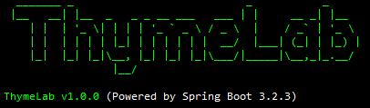

# ThymeLab Processor

ThymeLab Processor is a lightweight Spring Boot application designed to help designers and developers create and test Thymeleaf templates without setting up a complex backend system. It provides real-time hot reload capabilities, making the template development process faster and more efficient.

<p align="center">
   
</p>

> 🔗 **Related Tools**
> - [ThymeLab Launcher](https://github.com/thkwag/thymelab-launcher) - GUI application for managing ThymeLab Processor
> - [ThymeLab for VS Code](https://github.com/thkwag/thymelab-vscode) - VS Code extension for integrated development

## Overview

This tool is built with Spring Boot, focusing on simplicity and ease of use. It includes only the essential features needed for Thymeleaf template development:
- Thymeleaf template engine integration
- Hot reload functionality
- JSON-based data binding
- Static resource serving
- Basic security settings

## Running the Processor

You can run ThymeLab Processor in several ways:

1. **Direct Execution**:
   ```bash
   java -jar thymelab-processor-{version}.jar \
       -Dserver.port=8080 \
       -Dlogging.level.com.github.thkwag.thymelab=INFO \
       -Dwatch.directory.templates=/path/to/templates \
       -Dwatch.directory.thymeleaf-data=/path/to/thymelab/data \
       -Dwatch.directory.static=/path/to/static
   ```
   
   **Configuration Options**:
   - Server settings:
     - `-Dserver.port=8080`: Server port number
   - Log level:
     - `-Dlogging.level.com.github.thkwag.thymelab=INFO`: Log level (ERROR, WARN, INFO, DEBUG, TRACE)
   - Directory paths:
     - `-Dwatch.directory.templates`: Template files directory
     - `-Dwatch.directory.thymeleaf-data`: JSON data files directory
     - `-Dwatch.directory.static`: Static resources directory
   
   If directory paths are not specified, the following classpath defaults will be used:
   - Templates: `classpath:/default/templates/`
   - Data: `classpath:/default/thymelab/data/`
   - Static: `classpath:/default/static/`

2. **Using ThymeLab Launcher**:
   - Download [ThymeLab Launcher](https://github.com/thkwag/thymelab-launcher)
   - GUI application for easy processor management
   - Provides configuration UI and server controls

3. **VS Code Extension**:
   - Install [ThymeLab for VS Code](https://github.com/thkwag/thymelab-vscode)
   - Integrated development environment
   - Preview templates directly in VS Code
   - Server control through VS Code interface

## Key Features

- **No Backend Required**: Create and test Thymeleaf templates without implementing a backend system
- **Real-time Hot Reload**: Instantly see changes in templates, JSON data, and static resources
- **Simple JSON Data Management**: Manage template variables using simple JSON files
- **Layout System Support**: Create reusable layouts and fragments
- **Static Resource Serving**: Serve and test static resources (CSS, JavaScript, images)
- **Designer-Friendly**: Focus on template design without worrying about backend implementation
- **Request Information Access**: Access request information in templates using the `req` variable

## Benefits

- **Rapid Development**: See changes instantly without server restarts
- **Easy Collaboration**: Designers can work on templates independently
- **Simple Setup**: Start creating templates with minimal configuration
- **Flexible Data Management**: Modify template variables through JSON files
- **Production-Ready Templates**: Templates created with ThymeLab can be directly used in production Spring applications

## Project Structure

```
src/
  └── main/
      ├── java/
      │   └── com/github/thkwag/thymelab/processor/
      │       ├── config/         # Spring configurations
      │       ├── controller/     # Web controllers
      │       ├── hotreload/      # Hot reload implementation
      │       ├── interceptor/    # Web interceptors
      │       ├── service/        # Business logic services
      │       └── ThymeLabProcessorApplication.java
      └── resources/
          └── default/            # Default resources
              ├── thymelab/data/  # Default JSON data files
              ├── static/         # Default static resources
              └── templates/      # Default Thymeleaf templates
```

## Template Examples

### Layout Template
`templates/layout/default.html`
```html
<!DOCTYPE html>
<html xmlns:th="http://www.thymeleaf.org"
      xmlns:layout="http://www.ultraq.net.nz/thymeleaf/layout">
<head>
    <meta charset="UTF-8">
    <title th:text="${pageTitle}">Title</title>
    <link rel="stylesheet" th:href="@{/css/style.css}">
</head>
<body>
    <header th:replace="~{fragments/header :: header}"></header>
    <main layout:fragment="content"></main>
    <footer th:replace="~{fragments/footer :: footer}"></footer>
</body>
</html>
```

### Fragment Template
`templates/fragments/header.html`
```html
<!DOCTYPE html>
<html xmlns:th="http://www.thymeleaf.org">
<header th:fragment="header">
    <nav>
        <div class="logo" th:text="${siteName}">ThymeLab</div>
        <ul class="nav-links">
            <li th:each="item : ${menuItems}" th:classappend="${req.requestURI == item.url ? 'active' : ''}">
                <a th:href="@{${item.url}}" th:text="${item.name}">Menu Item</a>
            </li>
        </ul>
    </nav>
</header>
</html>
```

### Page Template
`templates/pages/about.html`
```html
<!DOCTYPE html>
<html xmlns:th="http://www.thymeleaf.org"
      xmlns:layout="http://www.ultraq.net.nz/thymeleaf/layout"
      layout:decorate="~{layout/default}">
<head>
    <title th:text="${pageTitle}">About</title>
</head>
<body>
    <main layout:fragment="content">
        <div class="about-section">
            <h1 th:text="${title}">About ThymeLab</h1>
            <p th:text="${description}" class="about-description">Description</p>
        </div>
        <div class="features">
            <div th:each="feature : ${features}" class="feature-card">
                <h3 th:text="${feature.title}">Feature Title</h3>
                <p th:text="${feature.description}">Feature Description</p>
            </div>
        </div>
    </main>
</body>
</html>
```

### Global Data
`thymelab/data/global.json`
```json
{
  "siteName": "ThymeLab",
  "menuItems": [
    {
      "name": "Home",
      "url": "/"
    },
    {
      "name": "About",
      "url": "/pages/about.html"
    }
  ]
}
```

### Page Data
`thymelab/data/pages/about.json`
```json
{
  "pageTitle": "About - ThymeLab",
  "title": "About ThymeLab",
  "description": "A development tool designed to streamline your Thymeleaf template development process.",
  "features": [
    {
      "title": "Template Preview",
      "description": "Real-time preview of Thymeleaf templates with dynamic data binding and hot reload."
    },
    {
      "title": "Project Structure",
      "description": "Organized project structure with separate directories for templates, fragments, and static resources."
    },
    {
      "title": "Data Binding",
      "description": "Flexible data binding system using JSON files for both global and page-specific template variables."
    },
    {
      "title": "Easy Installation",
      "description": "Simple setup process with the ThymeLab Launcher, no complex configuration required."
    }
  ]
}
```

These examples demonstrate:
- Layout template with title pattern and common structure
- Reusable header fragment with dynamic navigation
- Page template using layout and displaying dynamic content
- Global JSON data for site-wide variables
- Page-specific JSON data for individual page content


## Request Information Access
Since Thymeleaf 3.1, direct access to `#request`, `#session`, `#servletContext`, and `#response` objects has been restricted for security reasons ([see Migration Guide](https://www.thymeleaf.org/doc/articles/thymeleaf31whatsnew.html#expression-objects)).

ThymeLab provides a `req` variable through `GlobalControllerAdvice` to address this limitation and provide access to request information in templates. This feature is implemented in the `GlobalControllerAdvice` class:

```java
@ControllerAdvice
public class GlobalControllerAdvice {
    
    @ModelAttribute("req")
    public Map<String, Object> getRequestInfo(HttpServletRequest request) {
        Map<String, Object> requestInfo = new HashMap<>();
        requestInfo.put("requestURI", request.getRequestURI());
        requestInfo.put("requestURL", request.getRequestURL().toString());
        // ... other request properties
        return requestInfo;
    }
}
```

### Using the req Variable
You can access HttpServletRequest information in templates using the `req` variable:

```html
<!-- Get current URI -->
<div th:text="${req.requestURI}"></div>

<!-- Highlight active menu item -->
<li th:classappend="${req.requestURI == item.url ? 'active' : ''}">

<!-- Get server information -->
<div th:text="${req.serverName}"></div>
```

### Available req Properties
- `req.requestURI`: Current request URI
- `req.requestURL`: Complete URL (including protocol, host, and port)
- `req.method`: HTTP method (GET, POST, etc.)
- `req.protocol`: Protocol information
- `req.scheme`: URL scheme (http, https)
- `req.serverName`: Server name
- `req.serverPort`: Server port
- `req.contextPath`: Context path
- `req.servletPath`: Servlet path
- `req.pathInfo`: Additional path information
- `req.queryString`: Query string
- `req.remoteAddr`: Client IP address
- `req.remoteHost`: Client host
- `req.remotePort`: Client port
- `req.localAddr`: Local IP address
- `req.localName`: Local host name
- `req.localPort`: Local port


## Hot Reload

Hot Reload feature automatically detects changes in:
- Template files (.html)
- JSON data files
- Static resources (CSS, JavaScript, images, etc.)

Changes are instantly reflected in the browser without manual refresh, making the development process faster and more efficient.

## Development Tips

- Use the layout system to maintain consistent page structure
- Create reusable fragments for common components
- Organize JSON data files by feature or page
- Utilize global.json for site-wide variables
- Take advantage of hot reload for rapid iterations

## Build and Run

```bash
# Build
./gradlew :processor:build

# Run
./gradlew :processor:bootRun
```

## License

This project is licensed under the MIT License - see the [LICENSE](LICENSE) file for details.

